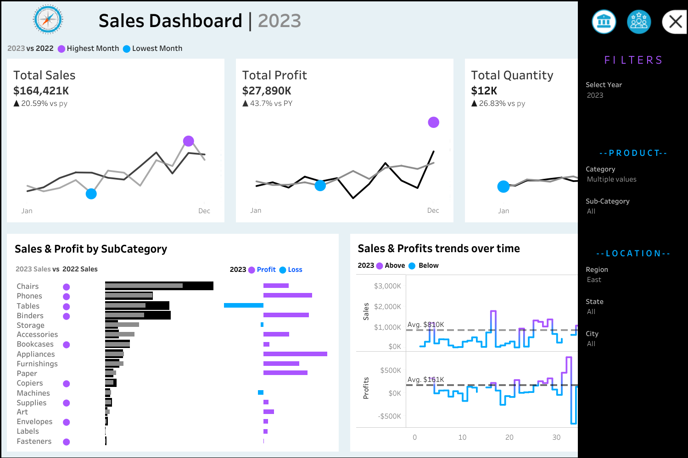

# 📊 Sales & Customer Dashboard

This repository contains my **Tableau Public Dashboard**, which analyzes sales and customer data.

## 🌐 Live Dashboard
🔗 [View on Tableau Public](https://public.tableau.com/views/Book2_17399043155480/CustomerDashboard?:language=en-US&:sid=&:redirect=auth&:display_count=n&:origin=viz_share_link)

## 📌 Features
- Sales trends & customer segmentation
- KPI visualization with interactive filters
- Data-driven insights for business growth

## 📷 Dashboard Preview

## 📂 Files
- `dashboard-link.txt` → Contains the Tableau Public URL
- `/images/` → Contains screenshots of the dashboard

## 📌 How to Use
1. Click the **Tableau Public link** above.  
2. Explore the dashboard and interact with filters.  
3. Download the `.twbx` file (if available).  

## 🏆 About Me
For questions, feel free to reach out via [LinkedIn](https://www.linkedin.com/in/deepali-konety-b64717275/).
